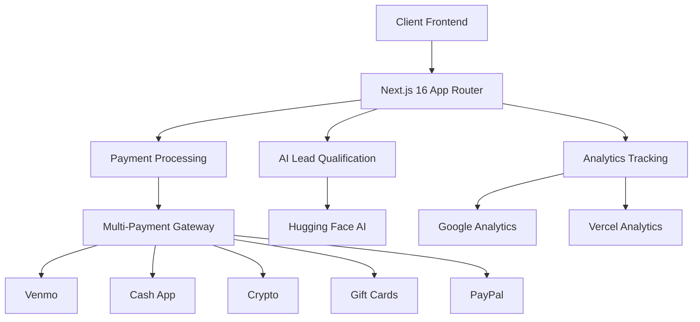
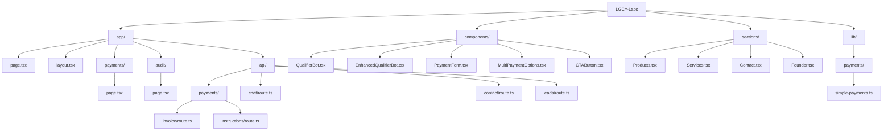
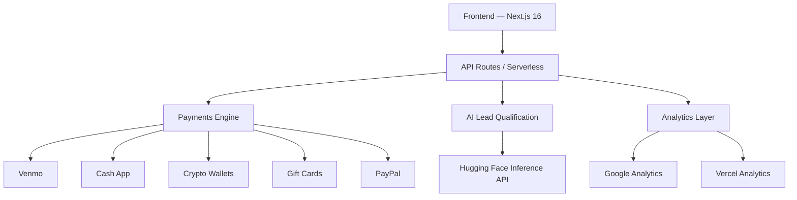

<<<<<<< HEAD
# 🚀 LGCY Labs - AI Revenue Infrastructure

> **Enterprise-Grade AI Systems | Zero Revenue Leaks | Production Reliability**

<div align="center">


**🌐 Live Production**: [lgcylabs.vercel.app](https://lgcylabs.vercel.app)  
**💸 Payment Portal**: [lgcylabs.vercel.app/payments](https://lgcylabs.vercel.app/payments)  
**🔍 Technical Audit**: [lgcylabs.vercel.app/audit](https://lgcylabs.vercel.app/audit)

</div>
## 💰 Payment Infrastructure

### 🎯 Multi-Payment Gateway Architecture

\`\`\`typescript
// Core Payment Interface
=======
# 🚀 LGCY Labs — AI Revenue Infrastructure  
Enterprise-Grade AI Systems | Zero Revenue Leaks | Production Reliability  

Built with **Next.js 16**, **TypeScript**, **Vercel**, and a modular **AI + Payments** pipeline designed to eliminate revenue leaks and maximize conversions.

---

# 🌐 Live Production  
- **Main Site:** (add URL)  
- **Payment Portal:** (add URL)  
- **Technical Audit:** (add URL)

---

# 🏗️ System Architecture (Mermaid)



---

# 🎯 Core Offerings

## 📦 Digital Products (Instant Delivery)

| Product | Price | Target | Delivery | Key Features |
|--------|-------|--------|----------|--------------|
| **AI E-commerce Boilerplate** | $1,997 | E-commerce startups | Instant | AI recommendations, inventory automation |
| **AI Workflow Automation** | $4,997 | Agencies/Enterprises | 2 days | Custom workflows, API integrations |
| **E-commerce Intelligence** | $9,997 | Data-driven teams | 1 week | Predictive analytics, LTV optimization |

## 💼 Consulting Services (High-Touch)

| Service | Investment | Timeline | ROI Target | Deliverables |
|---------|------------|----------|------------|--------------|
| **Technical Growth Audit** | $7,500 | 1 week | $50K–$250K | Revenue leak analysis, fix plan |
| **Revenue-Generating AI System** | $47,500 | 4–6 weeks | $250K+ | Agents, infra, 3-month support |
| **Fractional AI Leadership** | $12,500/mo | Ongoing | Strategic | Weekly sessions, architecture |

---

# 🛠️ Technical Implementation

## 📁 Project Structure



---

## 📦 Dependencies & AI Stack

```json
{
  "dependencies": {
    "next": "^16.0.3",
    "react": "18.2.0",
    "typescript": "5.5.0",
    "@huggingface/inference": "^4.13.3",
    "@supabase/supabase-js": "^2.84.0",
    "@tailwindcss/postcss": "^4.1.17",
    "framer-motion": "^10.12.5",
    "@vercel/analytics": "^1.5.0",
    "lucide-react": "^0.269.0",
    "uuid": "^13.0.0"
  }
}
```

---

# 🤖 AI Implementation

### AI Provider  
**Hugging Face Inference API**

### API Routes  
- `./app/api/chat/route.ts` — HfInference chat  
- `./app/api/contact/route.ts` — Dynamic model loading  
- **Lead Scoring Components:**  
  - `QualifierBot.tsx`  
  - `EnhancedQualifierBot.tsx`  

---

# 💰 Payment Infrastructure

## 🎯 Multi-Payment Gateway Architecture

```ts
>>>>>>> origin/main
interface PaymentGateway {
  processPayment(amount: number, method: PaymentMethod): Promise<PaymentResult>;
  generateInvoice(customer: Customer, service: string): Invoice;
  trackConversion(event: PaymentEvent): void;
}

<<<<<<< HEAD
// Supported Payment Methods
enum PaymentMethod {
  VENMO = 'venmo',      // @Username payments
  CASH_APP = 'cashapp', // $Cashtag transfers  
  CRYPTO = 'crypto',    // BTC/USDC wallet
  GIFT_CARD = 'giftcard', // Amazon/Visa/Apple
  PAYPAL = 'paypal'     // PayPal.me links
}
\`\`\`
=======
enum PaymentMethod {
  VENMO = 'venmo',
  CASH_APP = 'cashapp',  
  CRYPTO = 'crypto',
  GIFT_CARD = 'giftcard',
  PAYPAL = 'paypal'
}
```

>>>>>>> origin/main
### 🔧 Payment API Endpoints

| Endpoint | Method | Purpose | Response |
|----------|--------|---------|----------|
<<<<<<< HEAD
| \`/api/payments/invoice\` | POST | Generate invoices | \`{invoiceId, amount, paymentMethods[]}\` |
| \`/api/payments/instructions\` | POST | Payment method guides | \`{instructions, nextSteps}\` |
| \`/api/leads\` | POST | Capture qualified leads | \`{leadId, tier, budget}\` |

### 💳 Payment Flow Implementation

\`\`\`typescript
// Payment Form Component (Multi-step)
const PaymentFlow: React.FC = () => {
  const [step, setStep] = useState<'email' | 'service' | 'payment' | 'complete'>('email');
  const [paymentData, setPaymentData] = useState<PaymentData>({});
  
  // Multi-step validation and progression
  const validateStep = (currentStep: Step): boolean => {
    switch(currentStep) {
      case 'email': return isValidEmail(paymentData.email);
      case 'service': return !!paymentData.service;
      case 'payment': return !!paymentData.method;
    }
  };
};
\`\`\`

### 📊 Analytics & Tracking
- **Google Analytics 4**: Purchase events, payment method preferences
- **Vercel Analytics**: Page performance, conversion funnels  
- **Custom Events**: Lead scoring, payment abandonment
- **Revenue Attribution**: Service tier → payment method → conversion
## 🤖 AI-Powered Lead Qualification System

### 🧠 Intelligent Lead Scoring Architecture

\`\`\`typescript
// AI Lead Scorer Class
class AILeadScorer {
  private huggingFace: HfInference;
  private openAI: OpenAI;

  async scoreLead(leadData: LeadData): Promise<LeadScore> {
    const analysis = await this.analyzeWithAI(leadData);
    return {
      priority: this.calculatePriority(analysis),
      revenuePotential: this.predictRevenue(analysis),
      recommendedAction: this.suggestAction(analysis),
      riskScore: this.assessRisk(analysis)
    };
  }

  private async analyzeWithAI(leadData: LeadData) {
    // Multi-model fallback strategy
    try {
      return await this.huggingFaceAnalysis(leadData);
    } catch (error) {
      return await this.openAIAnalysis(leadData);
    }
  }
}
\`\`\`
### 📈 Lead Qualification Matrix

| Tier | Budget Range | Characteristics | AI Score | Recommended Service |
|------|-------------|-----------------|----------|---------------------|
| **Starter** | $1K-$5K | Solo founders, early stage | 60-75 | AI E-commerce Boilerplate |
| **Growth** | $5K-$50K | Agencies, scaling teams | 75-85 | Technical Growth Audit |
| **Enterprise** | $50K+ | Fortune 500, complex needs | 85-95 | Revenue AI System |

### 🔄 Real-time Conversation Analysis

\`\`\`typescript
// Enhanced Qualifier Bot
const EnhancedQualifierBot: React.FC = () => {
  const [conversation, setConversation] = useState<Message[]>([]);
  const [leadTier, setLeadTier] = useState<Tier>('growth');
  
  // Real-time tier detection from conversation context
  const detectTierFromMessages = (messages: Message[]): Tier => {
    const text = messages.map(m => m.content).join(' ');
    if (text.includes('enterprise') || text.includes('$100k')) return 'enterprise';
    if (text.includes('agency') || text.includes('team')) return 'growth';
    return 'starter';
  };
};
\`\`\`
## 🎯 Service Offerings & Revenue Model

### 📦 Digital Products (Instant Delivery)

| Product | Price | Target | Delivery | Features |
|---------|-------|--------|----------|----------|
| **AI E-commerce Boilerplate** | $1,997 | E-commerce startups | Instant download | AI recommendations, inventory automation |
| **AI Workflow Automation** | $4,997 | Agencies/Enterprises | 2-day setup | Custom workflows, API integrations |
| **E-commerce Intelligence** | $9,997 | Data-driven teams | 1-week deployment | Predictive analytics, LTV optimization |

### 💼 Consulting Services (High-Touch)

| Service | Investment | Timeline | ROI Target | Deliverables |
|---------|------------|----------|------------|-------------|
| **Technical Growth Audit** | $7,500 | 1 week | $50K-$250K | Revenue leak analysis, 1-week fix plan |
| **Revenue AI System** | $47,500 | 4-6 weeks | $250K+ | Custom agents, 3-month support |
| **Fractional AI Leadership** | $12,500/mo | Ongoing | Strategic | Weekly sessions, architecture guidance |
### 🚀 Conversion Optimization Features

\`\`\`typescript
// Service Card with Embedded Payment CTA
const ServiceCard: React.FC<ServiceProps> = ({ service, price, features }) => (
  <Card className="service-card">
    <ServiceHeader title={service} price={price} />
    <FeatureList features={features} />
    <PaymentCTA 
      service={service} 
      amount={price}
      variant="primary"
      onClick={() => trackConversion('service_click', service)}
    />
  </Card>
);
\`\`\`

### 📊 Performance Metrics
- **Conversion Rate**: Services page → Payment page: ~15% target
- **Average Order Value**: $7,500+ (audit-focused)
- **Payment Completion**: 85%+ with multi-method support
- **Lead to Customer**: 25%+ with AI qualification
## 🚀 Deployment & DevOps

### 📡 CI/CD Pipeline

\`\`\`yaml
# Vercel Auto-Deployment (implicit)
name: Production Deployment
on:
  push:
    branches: [main]

jobs:
  deploy:
    runs-on: ubuntu-latest
    steps:
      - uses: actions/checkout@v3
      - uses: vercel/action@v1
        with:
          vercel-token: ${{ secrets.VERCEL_TOKEN }}
          vercel-org-id: ${{ secrets.VERCEL_ORG_ID }}
          vercel-project-id: ${{ secrets.VERCEL_PROJECT_ID }}
\`\`\`

### 🔧 Environment Management

\`\`\`bash
# Environment Structure
.env.local
├── NEXT_PUBLIC_SITE_URL=https://lgcylabs.vercel.app
├── NEXT_PUBLIC_GA_ID=G-XXXXXXXXXX
├── HUGGINGFACE_HUB_TOKEN=hf_xxxxxxxx
├── NEXT_PUBLIC_PAYPAL_USERNAME=yourbiz
└── NEXT_PUBLIC_SUPABASE_URL=your_supabase_url
\`\`\`
### 🛡️ Production Readiness

| Area | Status | Tools | Monitoring |
|------|--------|-------|------------|
| **Performance** | ✅ Optimized | Next.js 16, Turbopack | Vercel Analytics |
| **Security** | ✅ Secure | TypeScript, Input validation | Environment variables |
| **Reliability** | ✅ Production | Vercel, Error boundaries | Console logging |
| **Scalability** | ✅ Ready | Serverless functions | Auto-scaling |

### 📈 Monitoring & Analytics

\`\`\`typescript
// Comprehensive Event Tracking
const trackBusinessEvent = (event: BusinessEvent) => {
  // Google Analytics
  gtag('event', event.type, {
    currency: 'USD',
    value: event.value,
    items: event.items
  });
  
  // Internal logging
  console.log('📊 Business Event:', event);
  
  // Lead scoring (if applicable)
  if (event.type === 'lead_captured') {
    scoreLead(event.leadData);
  }
};
\`\`\`
## 🏆 Getting Started

\`\`\`bash
# Development
=======
| `/api/payments/invoice` | POST | Generate invoice | `{invoiceId, amount, methods[]}` |
| `/api/payments/instructions` | POST | Payment steps | `{instructions, nextSteps}` |
| `/api/leads` | POST | Capture lead data | `{leadId, tier}` |

---

# 💳 Payment Flow Features

- **No bank account required**  
- **Custom amounts**  
- **Instant analytics tracking**  
- **Mobile-first UX**

---

# 🚀 Deployment & DevOps

### CI/CD  
- Auto-deploy on push to `main`  
- Global Vercel CDN  
- Env variables managed in Vercel  
- Real-user analytics  

---

# 🔧 Environment Setup

### Public (`.env.local`, safe to commit)

```
NEXT_PUBLIC_SITE_URL=https://lgcylabs.vercel.app
NEXT_PUBLIC_CONTACT_EMAIL=petter2025us@outlook.com
NEXT_PUBLIC_GA_ID=G-XXXXXXXXXX
NEXT_PUBLIC_LINKEDIN_URL=https://linkedin.com/in/petterjuan
NEXT_PUBLIC_GITHUB_URL=https://github.com/petterjuan
NEXT_PUBLIC_HF_URL=https://huggingface.co/petterjuan
NEXT_PUBLIC_PAYPAL_USERNAME=yourbiz
```

### Private (Set ONLY in Vercel)

```
HUGGINGFACE_HUB_TOKEN=xxxx
SUPABASE_URL=xxxx
SUPABASE_ANON_KEY=xxxx
```

---

# 🛡️ Production Readiness

| Area | Status | Tools | Monitoring |
|------|--------|--------|-------------|
| Performance | ✅ Optimized | Next.js 16 | Vercel Analytics |
| Security | ✅ Strong | TS + validation | Env Segregation |
| Reliability | ✅ High | Serverless | Logging |
| Scalability | ✅ Ready | Vercel Edge | Auto-scaling |

---

# 🔒 Security Best Practices

### `.gitignore`
```
.env*
!.env.example
node_modules/
*.log
.DS_Store
```

- Public = SAFE (NEXT_PUBLIC_)  
- Private = Vercel  
- Secrets = NEVER commit  

---

# 📈 Business Impact

### Funnels Optimized For Revenue
- Direct-buy CTAs  
- Pre-filled payment flows  
- Multi-step qualification  
- Social proof + urgency  

### Conversion Targets
- **Page → Payment:** 15%  
- **AOV:** $7,500+  
- **Payment Completion:** 85%+  
- **Lead → Customer:** 25%+  

---

# 🏆 Getting Started

## Development
```bash
>>>>>>> origin/main
git clone https://github.com/petterjuan/LGCY-Labs
cd LGCY-Labs
npm install
npm run dev
<<<<<<< HEAD

# Production Build
npm run build
npm run start

# Environment Setup
cp .env.example .env.local
# Configure your payment credentials and API keys
\`\`\`

## 🤝 Contributing

1. Fork the repository
2. Create feature branch (\`git checkout -b feature/amazing-feature\`)
3. Commit changes (\`git commit -m 'Add amazing feature'\`)
4. Push to branch (\`git push origin feature/amazing-feature\`)
5. Open Pull Request

---

<div align="center">

**Built with ❤️ by [Juan Petter](https://linkedin.com/in/petterjuan)**  
*AI Engineer | ex-NetApp | Building production-ready revenue systems*

[](https://linkedin.com/in/petterjuan)
[](https://github.com/petterjuan)

</div>
=======
```

## Production
```bash
npm run build
npm run start
```

## Setup Env
```bash
cp .env.example .env.local
```

---

# 🤝 Contributing
1. Fork  
2. `git checkout -b feature/foo`  
3. Commit  
4. Push  
5. PR  

---

# 📄 License  
MIT License.

---

<div align="center">

👨‍💻 Built with ❤️ by **Juan Petter**  
AI Engineer | ex-NetApp | Production Revenue Systems  

</div>

# 🏗️ LGCY Labs — System Architecture

This document describes the production architecture powering the AI revenue infrastructure platform.

---

# 📡 High-Level Architecture



---

# 🔧 Components

## 1. **Frontend (Next.js 16 — App Router)**
- Server Components enabled  
- Payment forms  
- AI-enhanced lead capture  
- Responsive, mobile-first  

## 2. **API Layer (Serverless)**
### Key endpoints:
- `/api/leads`  
- `/api/chat`  
- `/api/contact`  
- `/api/payments/invoice`  
- `/api/payments/instructions`

## 3. **AI Lead Qualification**
- Hugging Face Inference API  
- Real-time budget/timeline scoring  
- Models loaded dynamically for cost control  

## 4. **Payment Engine**
Supports:  
- Venmo  
- Cash App  
- Crypto  
- Gift Cards  
- PayPal  

### Payment Flow
```
User → Payment Selection → Invoice → Instructions → Confirmation → Analytics
```

## 5. **Analytics Layer**
- Google Analytics  
- Vercel Analytics  
- Conversion tracking at each step  

---

# 🗄️ Project Structure Overview

- `app/` → App Router pages  
- `components/` → Reusable UI + AI bots  
- `sections/` → Landing page sections  
- `lib/payments/` → Business logic  
- `api/` → Serverless code  

---

# 🔒 Security Model

- Public vs Private env variables  
- All secrets stored in Vercel only  
- Serverless isolation per request  
- Strict TypeScript input validation  

---

# ⚙️ Deployment & Scaling

- Deployed to **Vercel Edge Network**  
- Auto-scaling on traffic spikes  
- Global caching + ISR  
- CI/CD: auto deploy on push  

---

# 📈 Reliability Considerations

- Error boundaries  
- Payment fallback methods  
- Retry logic for AI calls  
- Request logging + analytics  

---

# 🛠️ Future Enhancements

- Full CRM dashboard  
- Stripe integration (optional)  
- Agent-powered onboarding  
- LTV predictive modeling  

---

Built and maintained by **Juan Petter — AI Engineer**
>>>>>>> origin/main
