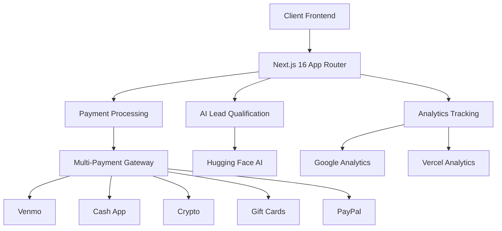
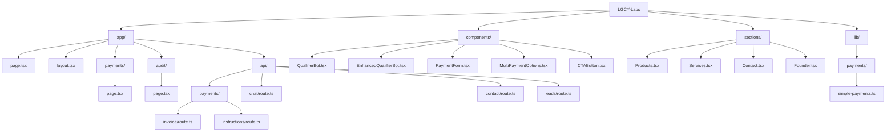
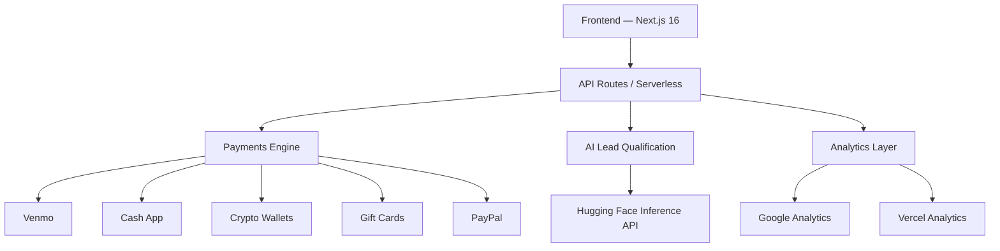

# 🚀 LGCY Labs — AI Revenue Infrastructure  
Enterprise-Grade AI Systems | Zero Revenue Leaks | Production Reliability  

Built with **Next.js 16**, **TypeScript**, **Vercel**, and a modular **AI + Payments** pipeline designed to eliminate revenue leaks and maximize conversions.

---

# 🌐 Live Production  
- **Main Site:** (add URL)  
- **Payment Portal:** (add URL)  
- **Technical Audit:** (add URL)

---

# 🏗️ System Architecture (Mermaid)



---

# 🎯 Core Offerings

## 📦 Digital Products (Instant Delivery)

| Product | Price | Target | Delivery | Key Features |
|--------|-------|--------|----------|--------------|
| **AI E-commerce Boilerplate** | $1,997 | E-commerce startups | Instant | AI recommendations, inventory automation |
| **AI Workflow Automation** | $4,997 | Agencies/Enterprises | 2 days | Custom workflows, API integrations |
| **E-commerce Intelligence** | $9,997 | Data-driven teams | 1 week | Predictive analytics, LTV optimization |

## 💼 Consulting Services (High-Touch)

| Service | Investment | Timeline | ROI Target | Deliverables |
|---------|------------|----------|------------|--------------|
| **Technical Growth Audit** | $7,500 | 1 week | $50K–$250K | Revenue leak analysis, fix plan |
| **Revenue-Generating AI System** | $47,500 | 4–6 weeks | $250K+ | Agents, infra, 3-month support |
| **Fractional AI Leadership** | $12,500/mo | Ongoing | Strategic | Weekly sessions, architecture |

---

# 🛠️ Technical Implementation

## 📁 Project Structure



---

## 📦 Dependencies & AI Stack

```json
{
  "dependencies": {
    "next": "^16.0.3",
    "react": "18.2.0",
    "typescript": "5.5.0",
    "@huggingface/inference": "^4.13.3",
    "@supabase/supabase-js": "^2.84.0",
    "@tailwindcss/postcss": "^4.1.17",
    "framer-motion": "^10.12.5",
    "@vercel/analytics": "^1.5.0",
    "lucide-react": "^0.269.0",
    "uuid": "^13.0.0"
  }
}
```

---

# 🤖 AI Implementation

### AI Provider  
**Hugging Face Inference API**

### API Routes  
- `./app/api/chat/route.ts` — HfInference chat  
- `./app/api/contact/route.ts` — Dynamic model loading  
- **Lead Scoring Components:**  
  - `QualifierBot.tsx`  
  - `EnhancedQualifierBot.tsx`  

---

# 💰 Payment Infrastructure

## 🎯 Multi-Payment Gateway Architecture

```ts
interface PaymentGateway {
  processPayment(amount: number, method: PaymentMethod): Promise<PaymentResult>;
  generateInvoice(customer: Customer, service: string): Invoice;
  trackConversion(event: PaymentEvent): void;
}

enum PaymentMethod {
  VENMO = 'venmo',
  CASH_APP = 'cashapp',  
  CRYPTO = 'crypto',
  GIFT_CARD = 'giftcard',
  PAYPAL = 'paypal'
}
```

### 🔧 Payment API Endpoints

| Endpoint | Method | Purpose | Response |
|----------|--------|---------|----------|
| `/api/payments/invoice` | POST | Generate invoice | `{invoiceId, amount, methods[]}` |
| `/api/payments/instructions` | POST | Payment steps | `{instructions, nextSteps}` |
| `/api/leads` | POST | Capture lead data | `{leadId, tier}` |

---

# 💳 Payment Flow Features

- **No bank account required**  
- **Custom amounts**  
- **Instant analytics tracking**  
- **Mobile-first UX**

---

# 🚀 Deployment & DevOps

### CI/CD  
- Auto-deploy on push to `main`  
- Global Vercel CDN  
- Env variables managed in Vercel  
- Real-user analytics  

---

# 🔧 Environment Setup

### Public (`.env.local`, safe to commit)

```
NEXT_PUBLIC_SITE_URL=https://lgcylabs.vercel.app
NEXT_PUBLIC_CONTACT_EMAIL=petter2025us@outlook.com
NEXT_PUBLIC_GA_ID=G-XXXXXXXXXX
NEXT_PUBLIC_LINKEDIN_URL=https://linkedin.com/in/petterjuan
NEXT_PUBLIC_GITHUB_URL=https://github.com/petterjuan
NEXT_PUBLIC_HF_URL=https://huggingface.co/petterjuan
NEXT_PUBLIC_PAYPAL_USERNAME=yourbiz
```

### Private (Set ONLY in Vercel)

```
HUGGINGFACE_HUB_TOKEN=xxxx
SUPABASE_URL=xxxx
SUPABASE_ANON_KEY=xxxx
```

---

# 🛡️ Production Readiness

| Area | Status | Tools | Monitoring |
|------|--------|--------|-------------|
| Performance | ✅ Optimized | Next.js 16 | Vercel Analytics |
| Security | ✅ Strong | TS + validation | Env Segregation |
| Reliability | ✅ High | Serverless | Logging |
| Scalability | ✅ Ready | Vercel Edge | Auto-scaling |

---

# 🔒 Security Best Practices

### `.gitignore`
```
.env*
!.env.example
node_modules/
*.log
.DS_Store
```

- Public = SAFE (NEXT_PUBLIC_)  
- Private = Vercel  
- Secrets = NEVER commit  

---

# 📈 Business Impact

### Funnels Optimized For Revenue
- Direct-buy CTAs  
- Pre-filled payment flows  
- Multi-step qualification  
- Social proof + urgency  

### Conversion Targets
- **Page → Payment:** 15%  
- **AOV:** $7,500+  
- **Payment Completion:** 85%+  
- **Lead → Customer:** 25%+  

---

# 🏆 Getting Started

## Development
```bash
git clone https://github.com/petterjuan/LGCY-Labs
cd LGCY-Labs
npm install
npm run dev
```

## Production
```bash
npm run build
npm run start
```

## Setup Env
```bash
cp .env.example .env.local
```

---

# 🤝 Contributing
1. Fork  
2. `git checkout -b feature/foo`  
3. Commit  
4. Push  
5. PR  

---

# 📄 License  
MIT License.

---

<div align="center">

👨‍💻 Built with ❤️ by **Juan Petter**  
AI Engineer | ex-NetApp | Production Revenue Systems  

</div>

# 🏗️ LGCY Labs — System Architecture

This document describes the production architecture powering the AI revenue infrastructure platform.

---

# 📡 High-Level Architecture



---

# 🔧 Components

## 1. **Frontend (Next.js 16 — App Router)**
- Server Components enabled  
- Payment forms  
- AI-enhanced lead capture  
- Responsive, mobile-first  

## 2. **API Layer (Serverless)**
### Key endpoints:
- `/api/leads`  
- `/api/chat`  
- `/api/contact`  
- `/api/payments/invoice`  
- `/api/payments/instructions`

## 3. **AI Lead Qualification**
- Hugging Face Inference API  
- Real-time budget/timeline scoring  
- Models loaded dynamically for cost control  

## 4. **Payment Engine**
Supports:  
- Venmo  
- Cash App  
- Crypto  
- Gift Cards  
- PayPal  

### Payment Flow
```
User → Payment Selection → Invoice → Instructions → Confirmation → Analytics
```

## 5. **Analytics Layer**
- Google Analytics  
- Vercel Analytics  
- Conversion tracking at each step  

---

# 🗄️ Project Structure Overview

- `app/` → App Router pages  
- `components/` → Reusable UI + AI bots  
- `sections/` → Landing page sections  
- `lib/payments/` → Business logic  
- `api/` → Serverless code  

---

# 🔒 Security Model

- Public vs Private env variables  
- All secrets stored in Vercel only  
- Serverless isolation per request  
- Strict TypeScript input validation  

---

# ⚙️ Deployment & Scaling

- Deployed to **Vercel Edge Network**  
- Auto-scaling on traffic spikes  
- Global caching + ISR  
- CI/CD: auto deploy on push  

---

# 📈 Reliability Considerations

- Error boundaries  
- Payment fallback methods  
- Retry logic for AI calls  
- Request logging + analytics  

---

# 🛠️ Future Enhancements

- Full CRM dashboard  
- Stripe integration (optional)  
- Agent-powered onboarding  
- LTV predictive modeling  

---

Built and maintained by **Juan Petter — AI Engineer**
